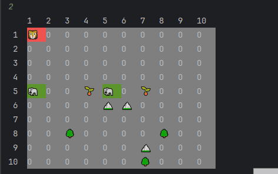

# Симуляция

Это консольное приложение, которое представляет собой симуляцию, включающую карты, сущности и взаимодействия между ними. Программа позволяет пользователю заполнить карту сущностями, а затем наблюдать их взаимодействие в системе, где сущности ищут еду с использованием алгоритма поиска в ширину (BFS).


## Описание

Программа моделирует симуляцию с возможностью:
- Заполнить карту вручную или автоматически.
- Управлять сущностями на карте (например, перемещать их, искать еду).
- Выполнять действия сущностей на каждом ходу симуляции.
- Пауза/возобновление симуляции через консольный ввод.

## Требования

Для запуска программы требуется Java 8 или выше.

## Пример работы программы



## Установка

1. Клонируйте репозиторий:

   ```bash
   https://github.com/fernerman/Simulation.git
